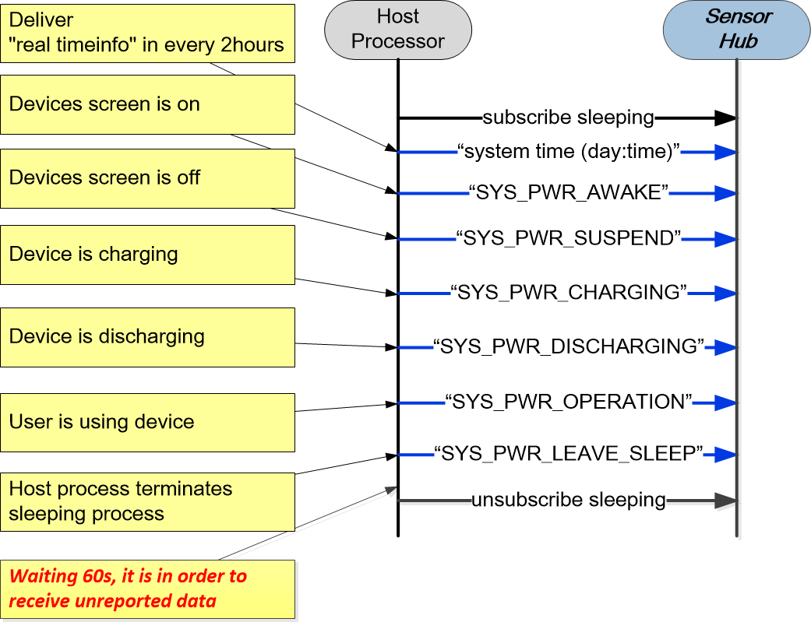

# Sleeping Implementation Statement

Sleeping virtual sensor was be activated; Host processor has to delivers `system power state` and `real time info` they are able to assist sleeping virtual sensor calculates data precisely.

As below, the illustrated figure expresses sleeping virtual sensor ative working scenario.

<br>

<br>

+ **System power state** delivers to sensor hub API

```text
typedef enum {
  SYS_PWR_AWAKE = 1,    /*Device screen is being on; Host processor is working*/
  SYS_PWR_SUSPEND.      /*Device screen is being off; Host process is suspending*/
  SYS_PWR_CHARGING,     /*Device is charging via USB cable*/
  SYS_PWR_DISCHARGING,  /*Device is discharging*/
  SYS_PWR_OPERATION,    /*User is using device*/
  SYS_PWR_LEAVE_SLEEP,  /*Host process requires sensor hub terminates sleeping processing*/
} pwr_state_id_t;

struct sensor_hub_sensor_params_t params;
pwr_state_id_t pwr_state = SYS_PWR_SUSPEND;

params.cmd = SH_CMD_HOST_SET_PARAM_POWER_STATUS;
params.data_addr = &pwr_state;
sensor_manager_setSensorParameters(SENSOR_TYPE_SLEEPING,
    &params, (sizeof(enum sensorhub_cmd_t)+sizeof(uint32_t)));
```

+ **Real time info** delivers to sensor hub API

```text
 struct system_time_t time;
 time.day = 1109;   /*NOV/09*/
 time.time = 1630;  /*PM 4:30*/
 params.cmd = SH_CMD_HOST_SET_PARAM_DATE_TIME;
 params.data_addr = &time;
 sensor_manager_setSensorParameters(SENSOR_TYPE_SLEEPING,
     &params, (sizeof(enum sensorhub_cmd_t)+sizeof(struct system_time_t)));
```
