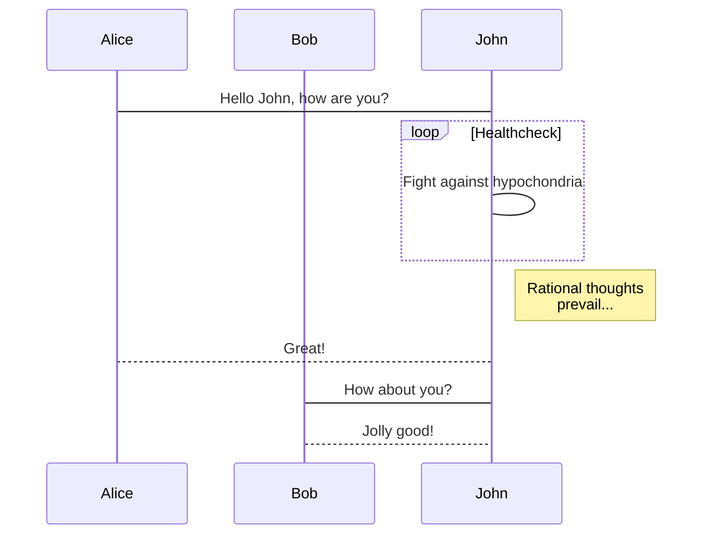
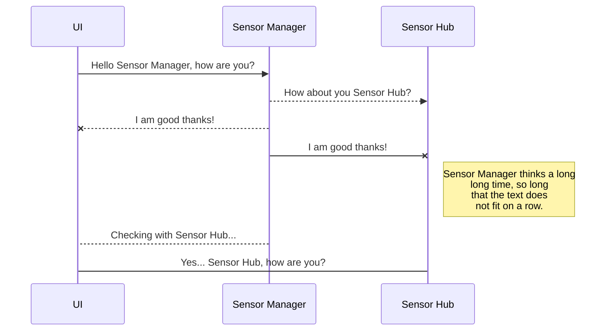

# SLEEPING VIRTUAL SENSOR

## Implementation Scenario


```mermaid
graph TD;
A-->B;
A-->C;
B-->D;
C-->D;
```

```mermaid
sequenceDiagram
participant Alice
participant Bob
Alice->John: Hello John, how are you?
loop Healthcheck
John->John: Fight against hypochondria
end
Note right of John: Rational thoughts <br/>prevail...
John-->Alice: Great!
John->Bob: How about you?
Bob-->John: Jolly good!
```


```mermaid
sequenceDiagram
UI ->> Sensor Manager: Hello Sensor Manager, how are you?
Sensor Manager-->>Sensor Hub: How about you Sensor Hub?
Sensor Manager--x UI: I am good thanks!
Sensor Manager-x Sensor Hub: I am good thanks!
Note right of Sensor Hub: Sensor Manager thinks a long<br/>long time, so long<br/>that the text does<br/>not fit on a row.

Sensor Manager-->UI: Checking with Sensor Hub...
UI->Sensor Hub: Yes... Sensor Hub, how are you?
```

[mermaid](https://mermaidjs.github.io/)
```text
{
  "plugins": ["fontsettings", "mermaid-gb3"]
}
